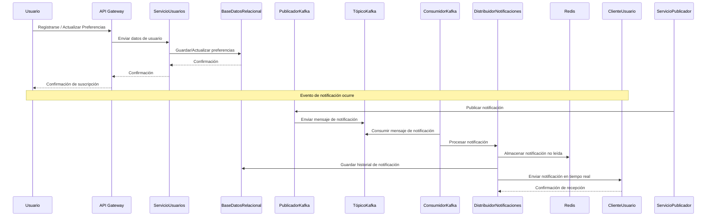
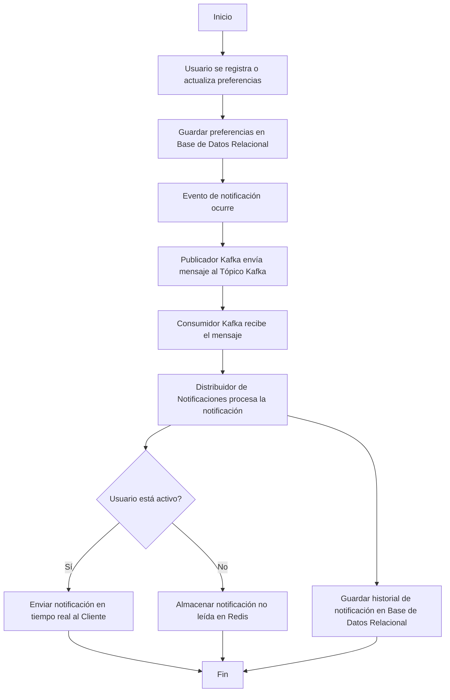
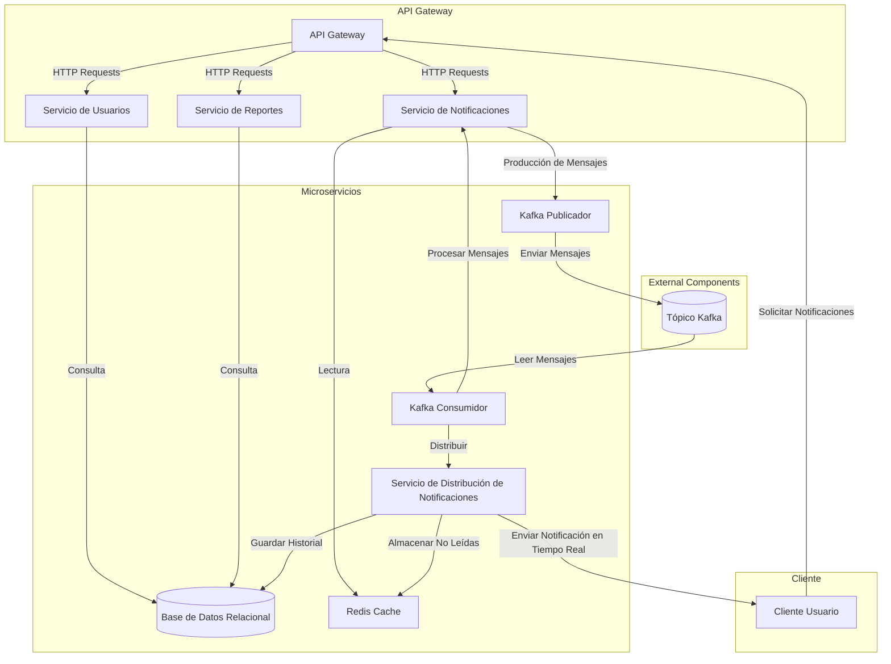
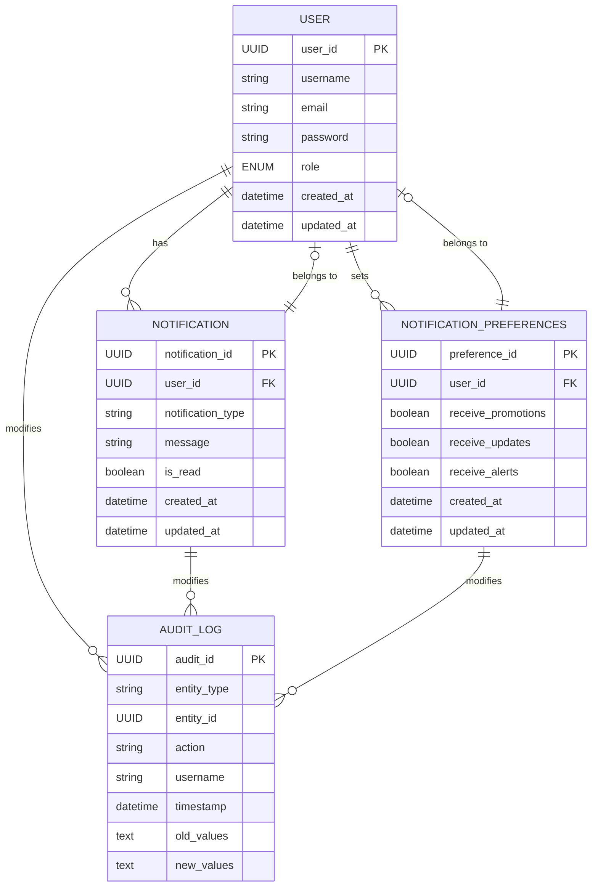
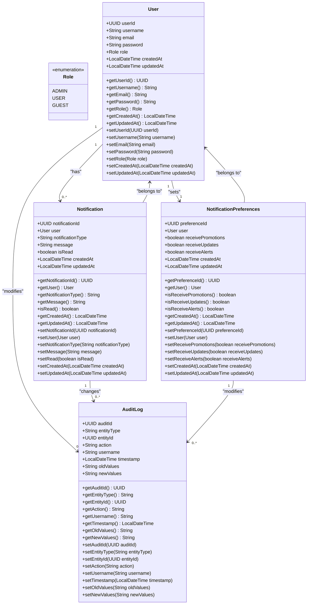

# RealTimeNotificationSystem

**RealTimeNotificationSystem** is a microservices-based application that provides real-time notifications to users. It utilizes **Apache Kafka** for event streaming, **Redis** for caching unread notifications, and a **relational database** (PostgreSQL or MySQL) to store user preferences and notification history. The system is designed to handle high-throughput notification events and deliver them instantly to users via a web or mobile client.

#### Features:
- **Real-time Notifications**: Uses Kafka to publish and consume notification events.
- **User Preferences**: Allows users to subscribe to different types of notifications.
- **Redis Caching**: Stores unread notifications for quick access and delivery.
- **Database Integration**: Stores user preferences and historical data in a relational database.
- **Scalable Architecture**: Built with microservices to scale individual components independently.

#### Technologies:
- **Spring Boot**: For building microservices.
- **Apache Kafka**: For event-driven messaging.
- **Redis**: For caching unread notifications.
- **PostgreSQL/MySQL**: For relational database storage.
- **Docker**: For containerized deployment.

## Diagrams

### Sequence diagram

### Flow chart diagram

### Component design diagram

### Entity diagram

### Class diagram

   ## Audit table

### Purpose of **`entity_id`** in the Audit Table:

The **`entity_id`** in the **`AuditLog`** table is used to uniquely identify the specific entity that was modified, created, or deleted. It stores the **ID** (unique identifier) of the entity being audited, allowing you to precisely link the audit log entry to the affected entity.

### Function of **`entity_id`**:

1. **Reference to the Modified Entity**:
    - The **`entity_id`** corresponds to the **UUID** of the entity that was affected (whether it’s a **User**, **Notification**, or **NotificationPreferences**). This helps identify exactly which record was modified.

2. **Linking with the Entity Type (`entity_type`)**:
    - Combined with the **`entity_type`** field, which indicates the type of entity (e.g., "User", "Notification"), the **`entity_id`** allows you to determine which record of which entity type was affected. For instance, you can identify that the user with `user_id = 123e4567-e89b-12d3-a456-426614174000` was updated.

3. **Change History**:
    - Using **`entity_id`**, you can retrieve the entire change history for a specific entity. For example, if you have multiple audit log entries related to the same `user_id`, you can track all changes that have been made to that user over time.

### Example:

Suppose a user with **`user_id = 123e4567-e89b-12d3-a456-426614174000`** updates their profile information. The entry in the **`AuditLog`** table could look like this:

| audit_id                              | entity_type | entity_id                            | action  | username   | timestamp              | old_values                            | new_values                            |
|---------------------------------------|-------------|---------------------------------------|---------|------------|------------------------|----------------------------------------|----------------------------------------|
| e89b4567-e89b-12d3-a456-426614174001   | User        | 123e4567-e89b-12d3-a456-426614174000 | UPDATE  | jdoe       | 2024-09-07T12:34:56     | {"email": "oldemail@example.com"}      | {"email": "newemail@example.com"}     |

- **`entity_id`** in this case is **`123e4567-e89b-12d3-a456-426614174000`**, which is the **user_id** of the modified user.
- **`entity_type`** is "User", indicating that the affected entity is a user.
- **`action`** is "UPDATE", showing that an update operation took place.
- **`old_values`** and **`new_values`** store the previous and updated values, respectively.