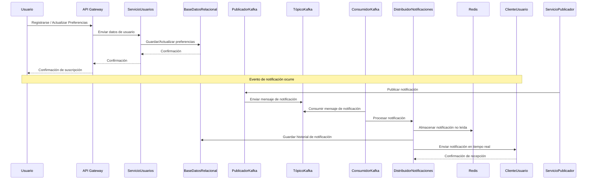
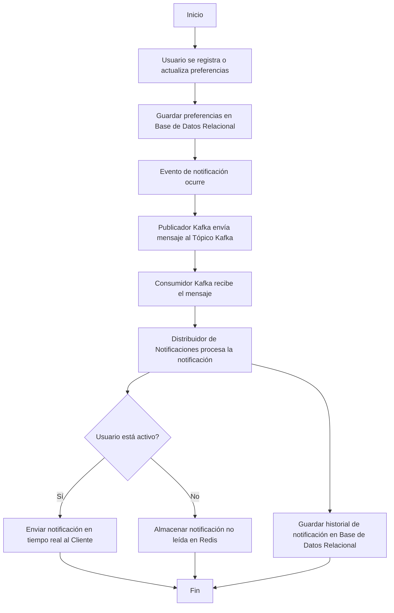
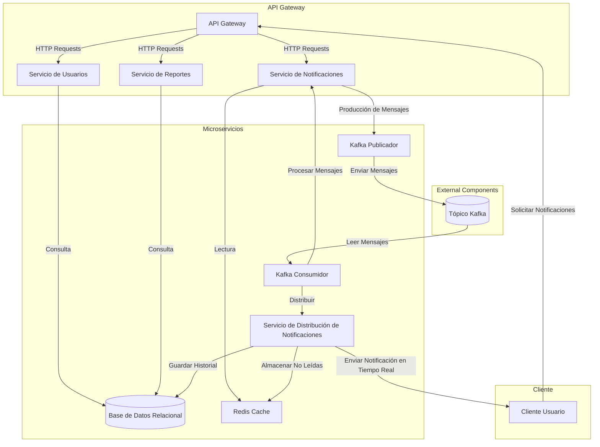

# RealTimeNotificationSystem

**RealTimeNotificationSystem** is a microservices-based application that provides real-time notifications to users. It utilizes **Apache Kafka** for event streaming, **Redis** for caching unread notifications, and a **relational database** (PostgreSQL or MySQL) to store user preferences and notification history. The system is designed to handle high-throughput notification events and deliver them instantly to users via a web or mobile client.

#### Features:
- **Real-time Notifications**: Uses Kafka to publish and consume notification events.
- **User Preferences**: Allows users to subscribe to different types of notifications.
- **Redis Caching**: Stores unread notifications for quick access and delivery.
- **Database Integration**: Stores user preferences and historical data in a relational database.
- **Scalable Architecture**: Built with microservices to scale individual components independently.

#### Technologies:
- **Spring Boot**: For building microservices.
- **Apache Kafka**: For event-driven messaging.
- **Redis**: For caching unread notifications.
- **PostgreSQL/MySQL**: For relational database storage.
- **Docker**: For containerized deployment.

## Diagrams

